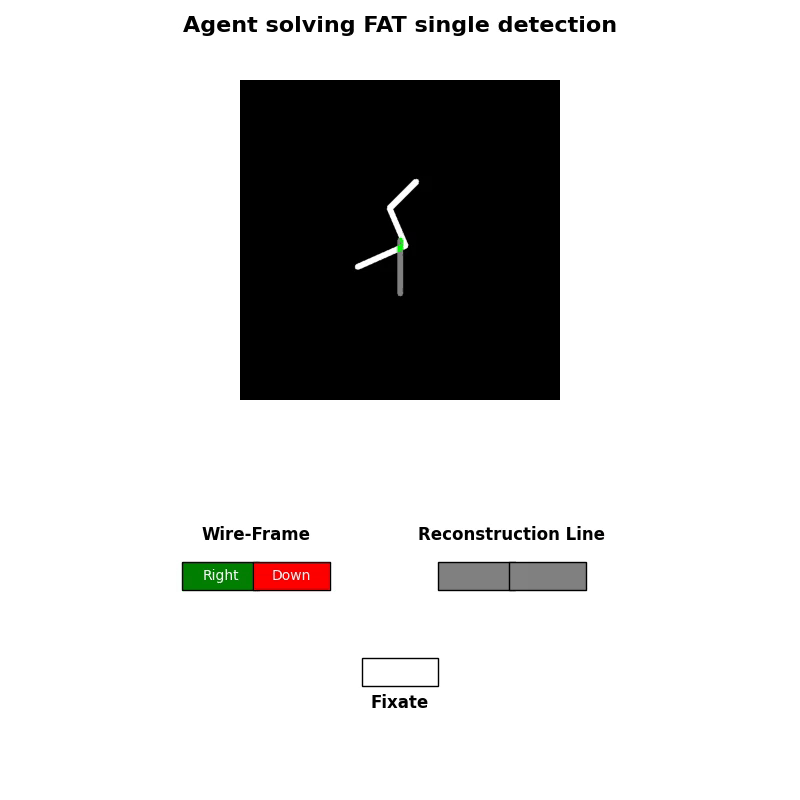
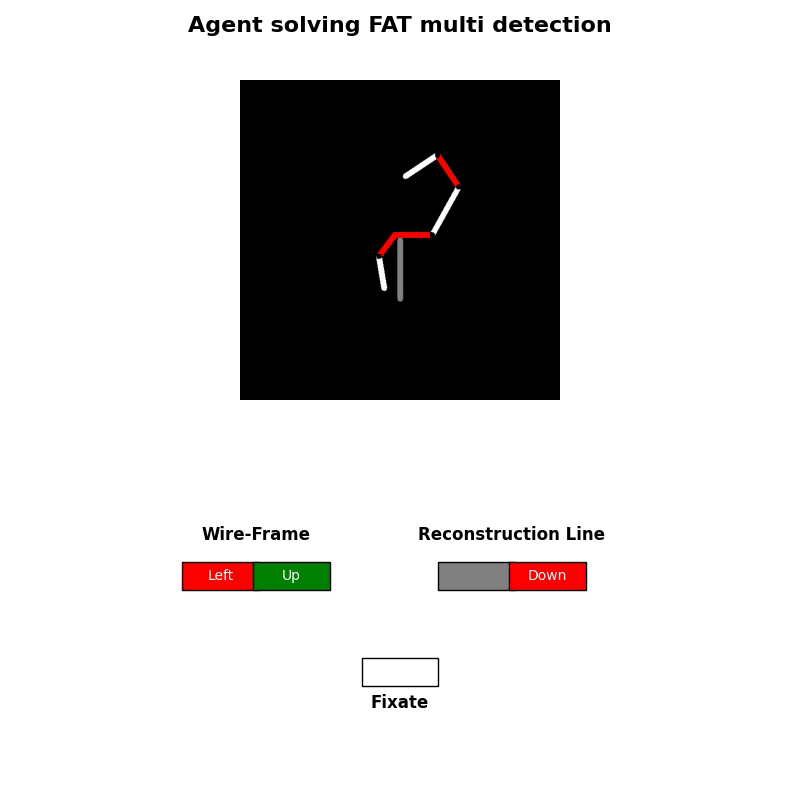

# RL_Wire-Frame_Reconstruction

This repository currently provides supplementary material and LaTEX source code for the RLDM submission "Utilizing Reinforcement Learning for Bottom-Up part-wise Reconstruction of 2D Wire-Frame Projections".

Documented Code will be added later in preparation for the conference itself. The Tag Submission Deadline refers to the Repositories state on the date of submission.

The [Submission](/Submission) directory contains the LaTEX source code, as well as the figures in original quality.
Furthermore, we provide some more incite by providing more example episodes in the following:

## Solved FAT single detection episode

## Solved FAT multi detection episode
